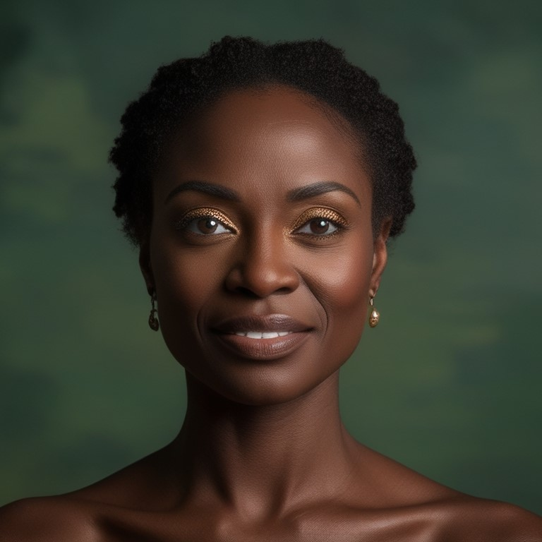
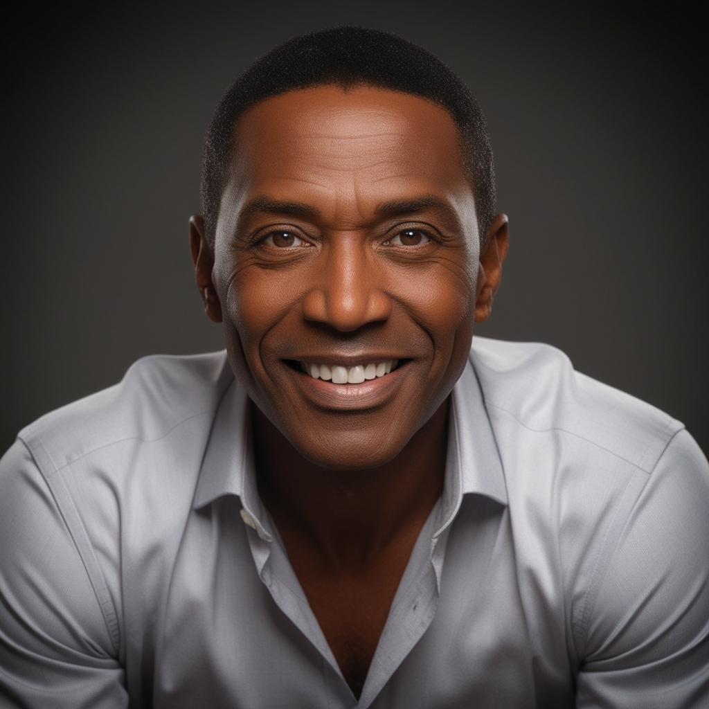

# 🤖 HUMANO₂ – Retratos Sintéticos da Era Digital

> “Nem natural, nem fake — apenas humano demais.”

Projeto desenvolvido para o desafio **[Natural ou Fake Natty? Como vencer na era das IAs generativas](https://www.dio.me/)** da DIO.

---

## 🧠 Conceito

HUMANO₂ explora a fronteira entre o **real e o artificial**:  
uma série de retratos hiper-realistas de pessoas que **não existem**, contrastados com retratos reais, para desafiar a percepção do público.

---

## 🎯 Objetivos

- Criar retratos realistas e convincentes com IA.  
- Provocar reflexão sobre identidade, autenticidade e emoção digital.  
- Demonstrar domínio técnico e sensibilidade artística no uso de IAs generativas.

---

## 🧰 Ferramentas Sugeridas

| Tipo | Ferramenta | Função |
|------|------------|--------|
| 🧠 IA de imagem | DALL·E / MidJourney / Leonardo.ai | Criação dos retratos sintéticos |
| ✍️ IA de texto | ChatGPT | Criação das biografias e legendas |
| 🖼️ Edição | Photoshop / Canva / GIMP | Ajustes visuais e montagem de pares |
| 📸 Banco de imagens | Unsplash / Pexels | Retratos reais livres de direitos |
| 📂 Documentação | GitHub + Markdown | Estrutura e exibição do projeto |

---

## 🖼️ Galeria: Natural ou Fake Natty?

> Tente adivinhar 👇  
> (respostas no final)

| Retrato A | Retrato B | Retrato C | Retrato D |
|-----------|-----------|-----------|-----------|
|  |  |  |  |
| Lara, fotógrafa de ruínas urbanas. | Theo, engenheiro que nunca existiu. | Sofia, designer de interiores. | Malik, músico inventado. |

💡 **Vote mentalmente:**  
🟢 = Natural  🔴 = Fake Natty  

<details>
<summary><b>Respostas</b></summary>

- Retrato A: 🟢 Natural  
- Retrato B: 🔴 Fake Natty  
- Retrato C: 🟢 Natural  
- Retrato D: 🔴 Fake Natty  

</details>

---

## 🧪 Prompts Usados (Exemplo)

**Retratos Sintéticos (IA)**

```text
1. Ultra realistic portrait of a middle-aged woman, subtle smile, cinematic lighting, 85mm lens, shallow depth of field, photorealistic
2. Ultra realistic portrait of a young man, short hair, friendly expression, soft natural lighting, cinematic style
